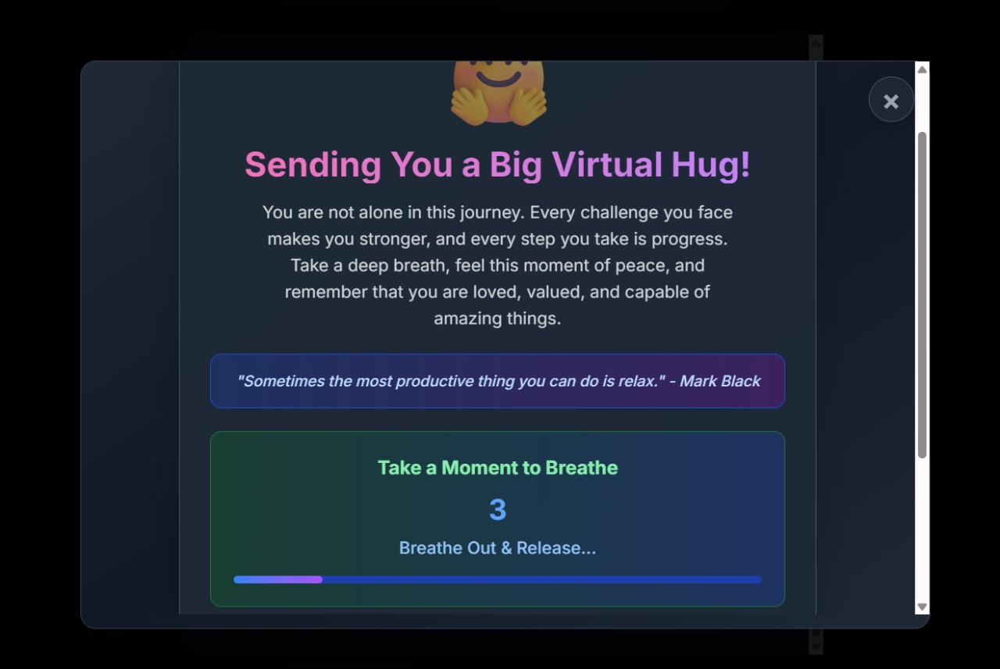

# 🛒OmniSense – Shopping, Reimagined
## 📌Overview <br>
OmniSense is an AI-powered, emotion-aware shopping assistant developed for the Walmart Sparkathon 2025, designed to help customers make better, kinder, and smarter purchasing decisions based on their mood, needs, and budget. By addressing the emotional and practical challenges faced by shoppers, OmniSense creates a personalized, uplifting retail experience.


🔗Live Demo: https://omni-sense.vercel.app/ <br>
One-Line Pitch: AI-powered assistant for accessible independence. Voice, emotion, AR – all in sync, for everyone.

## ❓Problem Statement
In today’s fast-paced retail environments, shoppers often feel anxious, tired, or overwhelmed, leading to rushed decisions, confusion over product labels, or disengagement. OmniSense targets:  
- Elderly and visually impaired individuals  
- Busy parents, students, or neurodiverse users  
- Anyone feeling emotionally drained or confused by health buzzwords
OmniSense bridges the emotional gap, creating a retail experience that listens, understands, and uplifts.

## 🌟Features
- 🎭AR Mood Detection:Detects customer mood in real-time using front camera via face-api.js or MediaPipe. Suggests tailored product bundles, e.g., “You look tired — here’s a Cozy Kit: Blanket + Tea + Eye Mask.”
  
  

- 🎙️Voice-to-Vision Mode:Users can voice commands like “Show me keto snacks under ₹200,” and the AI responds with friendly, voiced suggestions and AR-style visual cues (mocked).
  

- 🤖Predictive Checkout Concierge:Tracks cart, dietary preferences, and mood in real-time. At checkout, offers suggestions like, “You stayed under budget! Want to add a scented candle for ₹89?”
  

- 🧾Smart Product Explainer:Simplifies complex product terms (e.g., “low-GI,” “fortified oats,” “cold-pressed”) with tap-to-explain, layman-friendly definitions.
  

- 🧘Comfort Bundles & Mood Uplift:Crafts mood-based bundles like “Relax Kit” or “Energize Pack” tailored to user’s budget and emotional state. Includes self-care tips (e.g., “Text a friend 💌”), mood playlists, or uplifting jokes/missions.
  


## 🛠Tech Stack
| Category       | Tech                                                                 |
|----------------|----------------------------------------------------------------------|
| Frontend       | React.js (Next.js), Tailwind CSS                                     |
| Backend        | OpenAI GPT-3.5 via API routes, mock data via JSON                    |
| AI / UX        | GPT-generated suggestions, face-api.js / MediaPipe, Web Speech API   |
| AR Overlay     | Simulated glow border with shelf mapping                             |

## 🚀Installation

### Clone the Repository:  
```bash
git clone https://github.com/Khushi-51/OmniSense.git
cd OmniSense
```

### Install Dependencies:  
```bash
npm install
```

### Run the Application:  
```bash
npm run dev
```

### Access the App:
Open your browser and navigate to `http://localhost:3000` or visit the deployed version at 👉 https://omni-sense.vercel.app/

## 🗂Project Structure
```
OmniSense/
├── app/
│   ├── features/
│   │   ├── ar-mood-detection/     # AR mood detection feature
│   │   ├── voice-to-vision/       # Voice navigation feature
│   │   ├── predictive-checkout/   # Smart checkout feature
│   │   └── product-explainer/     # Product explanation feature
│   │       ├── page.tsx           # Main UI
│   │       └── components/        # UI components
├── images/                        # Screenshot images for README
├── public/                        # Static assets
├── README.md                      # Project documentation
└── package.json                   # Project dependencies and scripts
```

## 📸 Screenshots Setup Instructions

To ensure all images are visible to GitHub users, follow these steps:

1. **Save Screenshots**: Take screenshots of each feature and save them in the `images/` folder with these exact names:
   - `ar-mood-detection-home.png` - AR Mood Detection homepage
   - `ar-mood-detection-analysis.png` - AR Mood Detection analysis screen
   - `voice-to-vision.png` - Voice-to-Vision interface
   - `predictive-checkout.png` - Predictive Checkout screen
   - `product-explainer.png` - Product Explainer interface
   - `empathy-assistant.png` - Empathy Assistant modal

2. **Image Requirements**:
   - Format: PNG or JPG
   - Recommended size: 1200x800 pixels or similar aspect ratio
   - Clear, high-quality screenshots showing the key features

3. **Commit Images**: Make sure to commit and push the images to your GitHub repository:
   ```bash
   git add images/
   git commit -m "Add feature screenshots"
   git push origin main
   ```


## 📄License
This project is licensed under the MIT License. See the LICENSE file for details.

## 🎓Developed for Walmart Sparkathon 2025.  
Thanks to the open-source community for tools and libraries like face-api.js, and Web Speech API.  

🎥YouTube Demo Link :   <br>
💙Built With Empathy By Team : Sparkers
